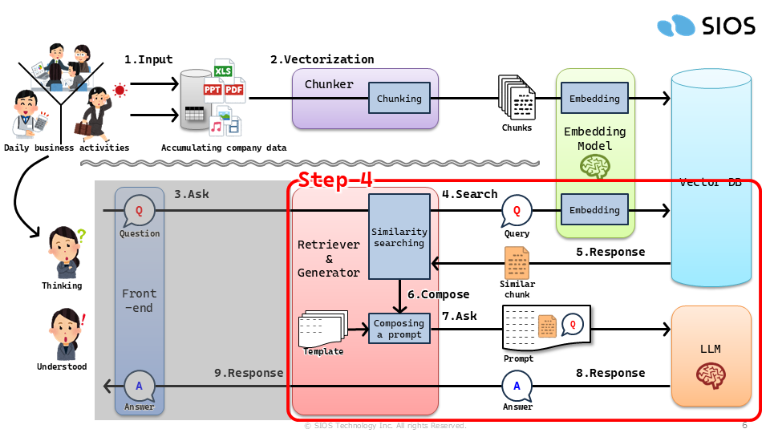

# Hands-on Training for RAG with LangChain

## 目次

1. [RAGの仕組み](#1-ragの仕組み)
2. [ハンズオン教材 with JupyterLab](#2-ハンズオン教材-with-jupyterlab)
	- 2.1. [教材一覧](#21-教材一覧)
	- 2.2. [ステップごとの教材内容](#22-ステップごとの教材内容)

---

## 1. RAGの仕組み

<table>
<tr><th colspan="2">仕組みを表したイラスト</th></tr>
<tr><td width="50%"> アニメーション版（流れを表現）</td><td  width="50%"> 静止画版（全体像を表現）</td></tr>
<tr><th colspan="2">仕組みの流れを説明</th></tr>
<tr><td colspan="2">
1から2はベクトルデータベースに類似検索に利用するデータの蓄積フェーズを意味し、 3から9はベクトルデータベースに蓄積されたデータを類似検索で活用する応用フェーズを意味します。
<ol>
<li>日々の経済活動を通じて、以下をはじめとするデータが企業のシステムに溜まります<ul><li>販売する商品の在庫管理情報や売上データ</li><li>経済取引を記録する会計データ</li><li>企業に関わる人材を把握する社員情報や顧客情報</li><li>企画提案、商品説明、および企業説明等で作成されたドキュメントファイル
など</li></ul></li>
<li>企業に溜まったデータを検索に活用するために、以下をはじめとする加工を施しながらベクトル化して蓄積します<ul><li>検索効率が向上するサイズにデータを細切れに分割するチャンキング</li><li>ベクトルデータベースで類似検索が出来るように数値ベクトルに変換するエンベディング</li><li>必要に応じて検索効率を向上させるため欠損値の削除や補完、値形式を揃えるクレンジング</li></ul></li>
<li>日々の業務活動を進めるに当たり不明点があれば質問を投げかけます</li>
<li>投げかけられた質問をエンベディングしてベクトルデータベースに対して類似検索します</li>
<li>投げかけられた質問に関連するデータを類似検索結果として戻します</li>
<li>LLMに回答を生成を依頼するために、依頼向けテンプレートに質問と類似検索結果を付与してプロンプトを作成します</li>
<li>質問に回答するためにプロンプトを用いてLLMに回答案の作成を依頼します</li>
<li>LLMが生成された回答案を戻します</li>
<li>LLMから戻された回答案を整形して質問者に回答を戻します</li>
</ol>
</td></tr>
</table>

---

## 2. ハンズオン教材 with JupyterLab

### 2.1. 教材一覧

- [Step 1: 構造化データのVector DB登録](./try-my-hand/lesson/rag-step01-excel_to_vectordb.ipynb)
- [Step 2: Vector DBで類似検索](./try-my-hand/lesson/rag-step02-search_from_vectordb.ipynb)
- [Step 3: LLM Template作成](./try-my-hand/lesson/rag-step03-llm_template.ipynb)
- [Step 4: Retriever+Generator構築](./try-my-hand/lesson/rag-step04-retriever_and_generator.ipynb)
- [Step 5: Web UI (Chatting with Open LLM)](./try-my-hand/lesson/rag-step05-web_ui_to_chat_with_llm.ipynb)

### 2.2. ステップごとの教材内容

<table>
<tr><th width="50%">RAG の仕組みで各ステップが該当する箇所</th><th width="50%">各ステップでハンズオンできる内容</th></tr>
<tr><td></td><td>
<b>ステップ1:</b> 教材の Notebook は以下 GitHub にて確認できます。
<ul><li><a href="./try-my-hand/lesson/rag-step01-excel_to_vectordb.ipynb">Step 1: 構造化データのVector DB登録</a></li></ul>
該当のステップでは、
RAGに必要な類似検索で利用するベクトルデータベースの環境を整えることを目的に、構造化データとして用意したExcelファイルをベクトル化してベクトルデータベースに保存する過程を経験します。
</td></tr>
<tr><td></td><td>
<b>ステップ2:</b> 教材の Notebook は以下 GitHub にて確認できます。
<ul><li><a href="./try-my-hand/lesson/rag-step02-search_from_vectordb.ipynb">Step 2: Vector DBで類似検索</a></li></ul>
該当のステップでは、
ひとつ前のステップで構造化データを登録したベクトルデータベースから、サンプルのクエリを投入して類似検索を実行する過程を経験します。
</td></tr>
<tr><td></td><td>
<b>ステップ3:</b> 教材の Notebook は以下 GitHub にて確認できます。
<ul><li><a href="./try-my-hand/lesson/rag-step03-llm_template.ipynb">Step 3: LLM Template作成</a></li></ul>
該当のステップでは、
質問者から投げかけられたクエリーと類似検索で得られた類似情報を使って、LLMに回答案の作成を依頼するために必要なテンプレートを準備する過程を経験します。
</td></tr>
<tr><td></td><td>
<b>ステップ4:</b> 教材の Notebook は以下 GitHub にて確認できます。
<ul><li><a href="./try-my-hand/lesson/rag-step04-retriever_and_generator.ipynb">Step 4: Retriever+Generator構築</a></li></ul>
該当のステップでは、
ここまでに経験してきた類似検索と準備したテンプレートを活用して、RetrieverとGeneratorを実装する過程を経験します。
</td></tr>
<tr><td></td><td>
<b>ステップ5:</b> 教材の Notebook は以下 GitHub にて確認できます。
<ul><li><a href="./try-my-hand/lesson/rag-step05-web_ui_to_chat_with_llm.ipynb">Step 5: Web UI (Chatting with Open LLM)</a></li></ul>
該当のステップでは、
ステップ2以降で経験してきたナレッジを活用して簡易的な RAG アプリケーションの構築を経験します。
</td></tr>
</table>

